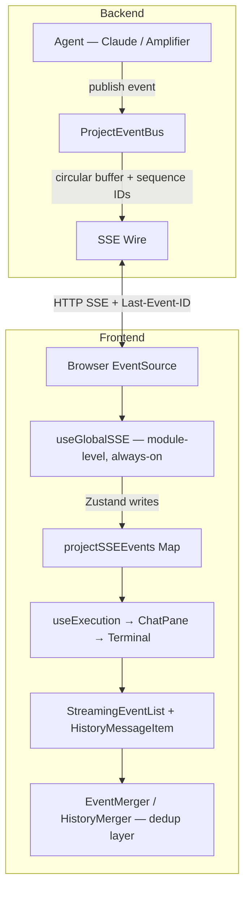
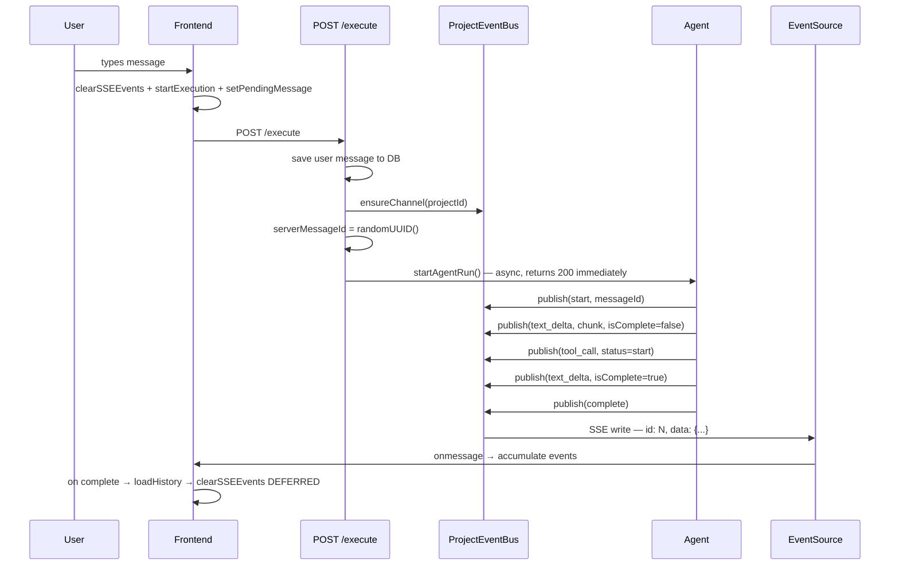
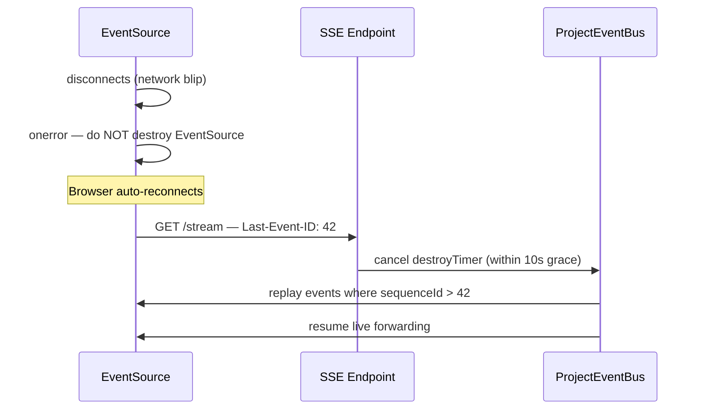

# spicy-specs.com Phase 1 Implementation Plan

> **For agentic workers:** REQUIRED SUB-SKILL: Use superpowers:subagent-driven-development (recommended) or superpowers:executing-plans to implement this plan task-by-task. Steps use checkbox (`- [ ]`) syntax for tracking.

**Goal:** Ship a working Astro site deployed to Cloudflare where entries are readable by humans at `/e/{slug}` (rendered HTML) and fetchable by agents at `/e/{slug}.md` (raw markdown), with a D1-backed comments system and one seed entry (`chat-streaming-sse`).

**Architecture:** Astro content collections with the `glob()` loader pull MDX entries from an `entries/` directory outside `src/`. Most pages are prerendered at build time (static HTML + static `.md` files). The comments API endpoint opts out of prerendering and runs as a Cloudflare Worker with D1 bindings. The Cloudflare adapter handles deployment as a Worker with static asset serving.

**Tech Stack:** Astro 5+ with MDX, TypeScript, Tailwind CSS v4 (via `@tailwindcss/vite`), `@astrojs/cloudflare` adapter, Cloudflare D1 for comments, Vitest for tests, pnpm.

**Design doc:** `docs/plans/2026-03-19-spicy-specs-design.md`

---

## File Map

Every file this plan creates, with its responsibility:

```
spicy-specs/
├── entries/                              # Entry content (MDX) — outside src/
│   └── backend/
│       └── chat-streaming-sse.mdx        # Seed entry
├── src/
│   ├── content.config.ts                 # Astro content collection definition + Zod schema
│   ├── pages/
│   │   ├── index.astro                   # Home page — entry listing with cards
│   │   ├── api/
│   │   │   └── comments.ts              # Server-rendered API endpoint — D1 read/write
│   │   └── e/
│   │       ├── [slug].astro              # Rendered HTML view for humans
│   │       └── [slug].md.ts              # Static .md endpoint for agents
│   ├── components/
│   │   ├── EntryCard.astro               # Card used in home listing
│   │   ├── EntryMeta.astro               # Type badge, category, tags, stats
│   │   └── CommentSection.astro          # Comment display + submission form
│   ├── layouts/
│   │   └── BaseLayout.astro              # Minimal shared HTML shell
│   └── styles/
│       └── global.css                    # Tailwind v4 import + custom properties
├── migrations/
│   └── 0001_create_comments.sql          # D1 schema migration
├── tests/
│   ├── content-schema.test.ts            # Zod schema validation tests
│   └── comments-api.test.ts             # Comments function unit tests
├── astro.config.mjs                      # Astro config — Cloudflare adapter, Tailwind, MDX
├── wrangler.toml                         # D1 binding config for local dev + deploy
├── vitest.config.ts                      # Vitest configuration
├── package.json
├── tsconfig.json
└── .dev.vars                             # Local dev secrets (empty placeholder)
```

**Key architecture decisions:**
- `src/content.config.ts` — Astro 5+ location (not the old `src/content/config.ts`)
- `glob()` loader with `base: "./entries"` — entries live outside `src/` for clean separation
- Comments API is an Astro server endpoint (`export const prerender = false`) — not a separate `functions/` directory, because `@astrojs/cloudflare` v13+ deploys as a Worker, not Pages Functions
- D1 bindings accessed via `import { env } from 'cloudflare:workers'` — the modern Cloudflare pattern

---

## Design Constraints (apply to every task)

1. **Clean like Context7.com** — white background, clean sans-serif typography, no decorative chrome, no hero banners, content-first
2. **Agent fetch URL is the first thing on every entry page** — prominently displayed before any prose, copyable one-click
3. **Entry type badges are visually distinct** — different color treatment per type (spec, reference-app, pattern, philosophy, anti-pattern)
4. **Confidence signals on cards** — stat chips showing counts derived from frontmatter metadata and MDX heading analysis
5. **No sidebar, full-width content** — MDX renders full-width with a clean reading experience
6. **Monochrome palette with one accent** — minimal color system (gray scale + one accent for interactive elements)

---

## Task 1: Project Scaffold

**Files:**
- Create: `package.json`
- Create: `astro.config.mjs`
- Create: `tsconfig.json`
- Create: `vitest.config.ts`
- Create: `src/styles/global.css`

- [ ] **Step 1: Initialize the Astro project with pnpm**

Run these commands from the repo root (`/Users/ken/workspace/ms/spicy-specs`):

```bash
# Initialize package.json (non-interactive)
pnpm init

# Install Astro + core dependencies
pnpm add astro @astrojs/mdx @astrojs/cloudflare @astrojs/sitemap

# Install Tailwind CSS v4 (Vite plugin — no tailwind.config.js needed)
pnpm add tailwindcss @tailwindcss/vite @tailwindcss/typography

# Install dev dependencies
pnpm add -D vitest typescript zod @cloudflare/workers-types wrangler
```

Expected: `node_modules/` created, `pnpm-lock.yaml` generated, all packages installed successfully.

- [ ] **Step 2: Create `astro.config.mjs`**

```javascript
// @ts-check
import { defineConfig } from "astro/config";
import mdx from "@astrojs/mdx";
import sitemap from "@astrojs/sitemap";
import cloudflare from "@astrojs/cloudflare";
import tailwindcss from "@tailwindcss/vite";

// https://astro.build/config
export default defineConfig({
  site: "https://spicy-specs.com",
  output: "static",
  adapter: cloudflare({
    imageService: "passthrough",
  }),
  integrations: [mdx(), sitemap()],
  vite: {
    plugins: [tailwindcss()],
  },
});
```

> **Note:** We use `output: "static"` so all pages prerender by default. The comments API endpoint will individually opt out with `export const prerender = false`, which automatically switches Astro to hybrid mode. The Cloudflare adapter handles serving both static assets and the server-rendered endpoint.

- [ ] **Step 3: Create `tsconfig.json`**

```json
{
  "extends": "astro/tsconfigs/strict",
  "compilerOptions": {
    "types": ["@cloudflare/workers-types/2023-07-01"]
  }
}
```

- [ ] **Step 4: Create `vitest.config.ts`**

```typescript
import { defineConfig } from "vitest/config";

export default defineConfig({
  test: {
    include: ["tests/**/*.test.ts"],
  },
});
```

- [ ] **Step 5: Create `src/styles/global.css`**

```css
@import "tailwindcss";
@plugin "@tailwindcss/typography";

@theme {
  --color-accent: #2563eb;
  --color-accent-light: #dbeafe;
  --font-sans: "Inter", ui-sans-serif, system-ui, sans-serif;
  --font-mono: "JetBrains Mono", ui-monospace, monospace;
}
```

- [ ] **Step 6: Add scripts to `package.json`**

Edit `package.json` to set the scripts, type, and name fields:

```json
{
  "name": "spicy-specs",
  "type": "module",
  "scripts": {
    "dev": "astro dev",
    "build": "astro build",
    "preview": "astro preview",
    "test": "vitest run",
    "test:watch": "vitest"
  }
}
```

(Keep the existing `dependencies` and `devDependencies` that pnpm wrote.)

- [ ] **Step 7: Verify the scaffold builds**

```bash
pnpm build
```

Expected: Build succeeds (may warn about no pages yet — that's fine). No errors about missing config or broken imports.

- [ ] **Step 8: Commit**

```bash
git add package.json pnpm-lock.yaml astro.config.mjs tsconfig.json vitest.config.ts src/styles/global.css
git commit -m "feat: scaffold Astro project with Cloudflare adapter and Tailwind v4"
```

---

## Task 2: Content Collection Schema + Tests

**Files:**
- Create: `src/content.config.ts`
- Create: `tests/content-schema.test.ts`
- Create: `entries/.gitkeep` (ensure directory exists)

- [ ] **Step 1: Write the schema validation tests**

Create `tests/content-schema.test.ts`:

```typescript
import { describe, it, expect } from "vitest";
import { z } from "zod";

// Define the schema here for testability — this is the exact same schema
// that lives in src/content.config.ts. We duplicate it here because
// importing from astro:content requires the Astro build pipeline,
// which isn't available in pure Vitest runs. Keep these two in sync.
const entrySchema = z.object({
  title: z.string(),
  slug: z.string(),
  type: z.enum(["spec", "reference-app", "pattern", "philosophy", "anti-pattern"]),
  category: z.enum(["ux", "infra", "backend", "agentic", "design"]),
  tags: z.array(z.string()),
  summary: z.string(),
  created: z.coerce.date(),
  updated: z.coerce.date(),
  status: z.enum(["draft", "published"]),
});

const validEntry = {
  title: "Chat Streaming with SSE",
  slug: "chat-streaming-sse",
  type: "spec" as const,
  category: "backend" as const,
  tags: ["sse", "streaming", "chat"],
  summary: "Canonical SSE chat streaming architecture with 19 anti-patterns.",
  created: "2026-03-19",
  updated: "2026-03-19",
  status: "published" as const,
};

describe("Entry frontmatter schema", () => {
  it("accepts valid frontmatter", () => {
    const result = entrySchema.safeParse(validEntry);
    expect(result.success).toBe(true);
  });

  it("coerces date strings to Date objects", () => {
    const result = entrySchema.parse(validEntry);
    expect(result.created).toBeInstanceOf(Date);
    expect(result.updated).toBeInstanceOf(Date);
  });

  it("rejects missing title", () => {
    const { title, ...noTitle } = validEntry;
    const result = entrySchema.safeParse(noTitle);
    expect(result.success).toBe(false);
  });

  it("rejects invalid type", () => {
    const result = entrySchema.safeParse({ ...validEntry, type: "tutorial" });
    expect(result.success).toBe(false);
  });

  it("rejects invalid category", () => {
    const result = entrySchema.safeParse({ ...validEntry, category: "devops" });
    expect(result.success).toBe(false);
  });

  it("rejects invalid status", () => {
    const result = entrySchema.safeParse({ ...validEntry, status: "archived" });
    expect(result.success).toBe(false);
  });

  it("rejects missing slug", () => {
    const { slug, ...noSlug } = validEntry;
    const result = entrySchema.safeParse(noSlug);
    expect(result.success).toBe(false);
  });

  it("rejects non-array tags", () => {
    const result = entrySchema.safeParse({ ...validEntry, tags: "sse" });
    expect(result.success).toBe(false);
  });

  it("accepts all five entry types", () => {
    const types = ["spec", "reference-app", "pattern", "philosophy", "anti-pattern"];
    for (const type of types) {
      const result = entrySchema.safeParse({ ...validEntry, type });
      expect(result.success, `type '${type}' should be valid`).toBe(true);
    }
  });

  it("accepts all five categories", () => {
    const categories = ["ux", "infra", "backend", "agentic", "design"];
    for (const cat of categories) {
      const result = entrySchema.safeParse({ ...validEntry, category: cat });
      expect(result.success, `category '${cat}' should be valid`).toBe(true);
    }
  });
});
```

- [ ] **Step 2: Run tests to verify they fail**

```bash
cd /Users/ken/workspace/ms/spicy-specs && pnpm test
```

Expected: Tests fail because `zod` isn't installed standalone yet (it's bundled in astro, but Vitest can't resolve `astro/zod` without the Astro pipeline). If the import fails, run `pnpm add zod` and re-run. The tests import from plain `zod`.

- [ ] **Step 3: Create `src/content.config.ts`**

```typescript
import { defineCollection } from "astro:content";
import { glob } from "astro/loaders";
import { z } from "astro/zod";

const entries = defineCollection({
  loader: glob({ base: "./entries", pattern: "**/*.mdx" }),
  schema: z.object({
    title: z.string(),
    slug: z.string(),
    type: z.enum(["spec", "reference-app", "pattern", "philosophy", "anti-pattern"]),
    category: z.enum(["ux", "infra", "backend", "agentic", "design"]),
    tags: z.array(z.string()),
    summary: z.string(),
    created: z.coerce.date(),
    updated: z.coerce.date(),
    status: z.enum(["draft", "published"]),
  }),
});

export const collections = { entries };
```

- [ ] **Step 4: Create `entries/.gitkeep`**

```bash
mkdir -p entries && touch entries/.gitkeep
```

- [ ] **Step 5: Run tests to verify they pass**

```bash
cd /Users/ken/workspace/ms/spicy-specs && pnpm test
```

Expected: All 10 tests PASS.

- [ ] **Step 6: Commit**

```bash
git add src/content.config.ts tests/content-schema.test.ts entries/.gitkeep
git commit -m "feat: add content collection schema with Zod validation and tests"
```

---

## Task 3: Seed Entry — `chat-streaming-sse`

**Files:**
- Create: `entries/backend/chat-streaming-sse.mdx`

This is a real entry adapted from the CHAT-STREAMING-AGENT-SPEC at `/Users/ken/workspace/emu/wk2/docs/03-technical/CHAT-STREAMING-AGENT-SPEC.md`. ASCII diagrams are converted to Mermaid. Frontmatter matches the Zod schema.

- [ ] **Step 1: Create the seed entry**

Create `entries/backend/chat-streaming-sse.mdx` with this content:

````mdx
---
title: "Chat Streaming with SSE"
slug: "chat-streaming-sse"
type: "spec"
category: "backend"
tags: ["sse", "streaming", "chat", "server-sent-events", "real-time", "pub-sub"]
summary: "Canonical SSE chat streaming architecture — 19 catalogued anti-patterns, 13 invariants, and a phased implementation fast path. Written for agents implementing or modifying chat streaming systems."
created: 2026-03-19
updated: 2026-03-19
status: "published"
---

> **Purpose:** This spec is written for AI agents implementing or modifying chat streaming systems. It captures the canonical final architecture, every mistake made during its development, and the invariants required to avoid repeating them. Read this **before** touching any code in the chat/streaming/pub-sub path.
>
> **Based on:** 19 bugs fixed across 29 commits — full codebase exploration and post-mortem analysis.

## Canonical Architecture Overview

The chat streaming system has three distinct layers:



| Layer | Component | Responsibility |
|---|---|---|
| Event bus | `ProjectEventBus` | Pub/sub channels, buffer (100 events), replay, SSE write |
| SSE endpoint | Stream route | `GET /projects/:id/stream`, reads `Last-Event-ID` |
| Execute endpoint | Message route | `POST /execute`, pre-generates serverMessageId, fires agent async |
| Agent (Anthropic) | ClaudeAgent | SDK streaming → SSE event translation |
| Agent (Amplifier) | AmplifierAgent | AmplifierClient → SSE event translation |
| SSE client | useGlobalSSE | Module-level EventSource registry, event accumulation, Zustand writes |
| Merge logic | EventMerger | `mergeForDisplay()`: history + streaming + optimistic → MergedMessage[] |
| Merge logic | HistoryMerger | Reference-preserving merge to prevent React scroll jumps |
| Live render | StreamingEventList | Live event rendering, tool dedup, history-skip guards |

## Complete Event Flow

### Happy Path



### Reconnect Path



## Key Design Decisions (Non-Negotiable)

These are architectural decisions reached after debugging 19 bugs. **Do not change these without strong justification and full regression testing.**

### D1 — Always-On SSE (not execution-gated)

The SSE connection opens when a component **mounts**, not when execution starts.

**Why:** If connection is gated on `isExecuting`, there is an inherent race: early events (start, status, first text_delta) can arrive before `isReady` is set, dropping them permanently.

```typescript
// ✅ CORRECT: open on mount
useGlobalSSE(projectId, !isTerminalMode)

// ❌ WRONG: gating on execution state
useGlobalSSE(projectId, isExecuting && !terminalProcessId)
```

### D2 — Server-Authoritative Message IDs

The server **pre-generates** `serverMessageId = randomUUID()` in the route handler **before** calling `agent.run()`. This ID is emitted in the very first `start` SSE event. The client **never invents IDs**.

```typescript
// ✅ CORRECT:
const serverMessageId = randomUUID();
await startAgentRun(projectId, message, serverMessageId);
// agent emits: publish({ type: 'start', messageId: serverMessageId })

// ❌ WRONG: client generates ID, or server omits messageId from SSE events
```

### D3 — Deferred SSE Clear

When the `complete` event arrives, SSE events are **NOT** cleared immediately. `clearSSEEvents()` is called **inside** `loadConversationHistory()`, **after** `setConversationHistory()`.

**Why:** If SSE is cleared synchronously on `complete`, there is a blank frame: streaming blocks disappear before history blocks appear.

```typescript
// ✅ CORRECT:
async function loadConversationHistory() {
  const history = await fetch('.../history');
  setConversationHistory(mergeHistory(prev, history)); // ← history appears
  clearSSEEvents(projectId);                           // ← streaming disappears AFTER
}

// ❌ WRONG: clearSSEEvents(projectId) immediately on complete
```

### D4 — Reference-Preserving History Merge

`mergeHistory()` must preserve object references for matching `messageId` entries so `React.memo` skips re-renders, preventing scroll jumps.

```typescript
// ✅ CORRECT: reuse existing object refs by messageId
function mergeHistory(prev, incoming) {
  const prevById = new Map(prev.map(m => [m.messageId, m]));
  return incoming.map(m => prevById.get(m.messageId) ?? m);
}

// ❌ WRONG: return incoming — new array + new objects every time = scroll jump
```

### D5 — Circular Buffer with 10s Grace Period

`ProjectEventBus` keeps a circular buffer of last 100 events per channel. Channels survive for 10 seconds after the last subscriber leaves.

### D6 — `ensureChannel()` Before `agent.run()`

Call `ensureChannel(projectId)` **before** `agent.run()`. Never let the first event create the channel — it will be lost.

### D7 — Module-Level SSE Connection Registry

SSE connections live in a **module-level** `Map`, outside React. They survive component unmounts and remounts.

### D8 — Unified Tool Completion Signal

Both agents use the **double-start pattern** for tool call completion: emit `tool_call status:'start'` twice — once on call, once on completion (with `success`, `duration` added).

## Anti-Pattern Registry (All 19 Bugs)

### Category A: SSE Connection Lifecycle (7 bugs)

| ID | Bug | Correct Pattern | Test Signal |
|---|---|---|---|
| A1 | Execution-gated SSE with stale `isReady` | Always-on SSE (D1). Clear `isReady` on SSE disable. | Multi-turn fails on turn 2 |
| A2 | Events fired before connection re-established | `agent.resetSSEReady()` in `res.on('close')` handler | Text appears all at once on turn 2+ |
| A3 | Stale `reconnect()` closing connection mid-stream | Never call `reconnect()` after successful POST | Streaming text appears all at once |
| A4 | Always-on SSE gate wrong | Gate is `!terminalProcessId` only | Races on second+ turns |
| A5 | No event buffer — reconnect loses events | 100-event circular buffer with sequence IDs + `Last-Event-ID` replay | After network blip, text is incomplete |
| A6 | Channel destroyed immediately on last disconnect | 10-second grace period on channel destruction | Buffer gone before reconnect |
| A7 | Manual reconnect loop duplicating native behavior | Remove manual loop; native `EventSource` handles reconnection | Race conditions between manual and auto reconnect |

### Category B: Message Synchronization & Deduplication (5 bugs)

| ID | Bug | Correct Pattern | Test Signal |
|---|---|---|---|
| B1 | Scroll jump flash on completion | Deferred SSE clear (D3) | Chat scrolls up on completion |
| B2 | Client-side message ID invention | Server pre-generates UUID (D2) | Deduplication unreliable |
| B3 | `eventsLength` hardcoded to 0 | Read from Zustand store, never pass as prop | Redundant history re-fetches |
| B4 | MessageId derivation excluding terminal events | Scan ALL events including terminal ones | Streaming block not suppressed |
| B5 | Optimistic message re-append race | `!isExecuting` gate + `mergeHistory()` re-appends | Message appears twice or vanishes |

### Category C: Event Streaming Quality (2 bugs)

| ID | Bug | Correct Pattern |
|---|---|---|
| C1 | Tool call rendering mismatch (Claude vs Amplifier) | Double-start pattern (D8) + `emittedToolIds` Set for dedup |
| C2 | Reasoning block duplication on flush | Search backwards for last incomplete reasoning block |

### Category D: State Management & Cleanup (5 bugs)

| ID | Bug | Correct Pattern |
|---|---|---|
| D1 | Status dots never stop pulsing | `animate-pulse` only when `!isComplete` |
| D2 | Auto-naming infinite retries on empty string | `!== undefined` check, not truthiness (`!!`) |
| D3 | EventEmitter listener warnings | `emitter.setMaxListeners(0)` in `createChannel()` |
| D4 | Dead code with destructive cleanup bug | Delete dead code; never `removeAllListeners()` on running agent |
| D5 | Empty projectId guard missing | `if (!projectId) return;` at top of effect |

## Invariants — Hard Rules

| # | Invariant | Why It Matters |
|---|-----------|----------------|
| I1 | `ensureChannel()` MUST be called before `agent.run()` | First published event lost if channel doesn't exist |
| I2 | `serverMessageId` MUST be pre-generated, emitted in BOTH `start` AND `complete` events | Client dedup depends on canonical IDs |
| I3 | SSE connection MUST open on mount, not on execution start | No window for early event loss |
| I4 | `clearSSEEvents()` MUST be called AFTER `setConversationHistory()` | Prevents blank frame |
| I5 | `mergeHistory()` MUST preserve object references for matching messageIds | Prevents scroll jumps |
| I6 | `removeAllListeners()` MUST NEVER be called on a running agent | Kills in-flight events |
| I7 | `text_delta_accumulated` MUST be maintained in-place | Prevents O(n) growth per chunk |
| I8 | Tool completion detection MUST check BOTH `status === 'end'` AND `success !== undefined` | Handles both agent patterns |
| I9 | `eventsLength` MUST be read from store, never passed as prop | Prop pinned to initial value |
| I10 | History load on `eventsLength === 0` MUST be gated on `!isExecuting` | Prevents history fetch race |
| I11 | Reasoning block search MUST scan backwards from tail | Text deltas interleave |
| I12 | Empty-string check MUST use `!== undefined`, not truthiness | Tool-only responses produce `""` |
| I13 | `Last-Event-ID` header handling MUST account for array form | Proxies can duplicate the header |

## Implementation Fast Path

If building chat streaming from scratch, implement in this order. Each phase has a gate.

### Phase 1 — Backend Event Bus
Build `ProjectEventBus` with channels, `publish()`, `subscribe()`, heartbeat, sequence IDs, circular buffer (100 events), `ensureChannel()`, 10s grace period.
**Gate:** 9+ unit tests green.

### Phase 2 — SSE Endpoint + Agent Integration
Build `GET /stream` with `Last-Event-ID` replay, `POST /execute` with pre-generated `serverMessageId`, agents emit `start`/`complete` with messageId.
**Gate:** curl sees SSE events; reconnect with `Last-Event-ID` replays missed events.

### Phase 3 — Frontend SSE Client
Build `useGlobalSSE` (module-level, always-on, native EventSource), event accumulation, Zustand store.
**Gate:** Events appear in React state, text streams character-by-character.

### Phase 4 — History Fetch with Deferred Clear
Build `HistoryMerger` (reference-preserving), `useConversation` with deferred `clearSSEEvents`.
**Gate:** No scroll jumps, no blank frames. 15+ merge tests green.

### Phase 5 — Terminal Render + Deduplication
Build `EventMerger`, `StreamingEventList`, `Terminal` render.
**Gate:** No duplicate messages on any turn.

### Phase 6 — Execution Indicators + UX
Wire `ExecutionIndicator`, status events, `animate-pulse` gated on `!isComplete`.
**Gate:** Indicator appears on send, stops on completion.

## Known Fragility Areas

| Severity | Area | Detail |
|---|---|---|
| 🔴 HIGH | Dual tool completion signals | `isToolComplete = status === 'end' \|\| success !== undefined \|\| isComplete` — the `isComplete` fallback exists because `tool_end` events can be lost on reconnect. Do not remove. |
| 🔴 HIGH | JWT in SSE URL | Native `EventSource` cannot set headers. Token passed as `?token=...` query param. Any auth refactor must account for this. |
| 🟡 MEDIUM | Terminal SSE has no replay mechanism | No `Last-Event-ID` mechanism — reconnect during active output will miss events. |
| 🟡 MEDIUM | addRawListener naming leak on hung agent | Listener outlives purpose if `agent.run()` never resolves. Needs timeout-based cleanup. |
| 🟡 MEDIUM | History load gate creates one-way dependency | History only loads when `eventsLength === 0`. If SSE events never clear, history never reloads. |
| 🟢 LOW | text_delta accumulation complexity | ~70 lines of backward search + append/create logic. New interleaving event types must be verified. |
````

- [ ] **Step 2: Verify the build sees the entry**

```bash
cd /Users/ken/workspace/ms/spicy-specs && pnpm build 2>&1 | head -30
```

Expected: Build runs. Astro discovers the `entries` collection with 1 entry. May warn about missing pages (no pages rendering it yet) — that's fine.

- [ ] **Step 3: Commit**

```bash
git add entries/backend/chat-streaming-sse.mdx
git commit -m "feat: add chat-streaming-sse seed entry"
```

---

## Task 4: BaseLayout + Global Styles

**Files:**
- Create: `src/layouts/BaseLayout.astro`

- [ ] **Step 1: Create `src/layouts/BaseLayout.astro`**

```astro
---
import "../styles/global.css";

interface Props {
  title: string;
  description?: string;
}

const { title, description = "Patterns, specs, and anti-patterns for humans and agents." } = Astro.props;
---

<!doctype html>
<html lang="en">
  <head>
    <meta charset="utf-8" />
    <meta name="viewport" content="width=device-width, initial-scale=1" />
    <meta name="description" content={description} />
    <title>{title} — spicy-specs</title>
    <link rel="preconnect" href="https://fonts.googleapis.com" />
    <link rel="preconnect" href="https://fonts.gstatic.com" crossorigin />
    <link
      href="https://fonts.googleapis.com/css2?family=Inter:wght@400;500;600;700&family=JetBrains+Mono:wght@400;500&display=swap"
      rel="stylesheet"
    />
  </head>
  <body class="bg-white text-gray-900 font-sans antialiased">
    <header class="border-b border-gray-200">
      <nav class="max-w-4xl mx-auto px-6 py-4 flex items-center justify-between">
        <a href="/" class="text-lg font-semibold tracking-tight text-gray-900 hover:text-accent no-underline">
          spicy-specs
        </a>
        <a
          href="https://github.com/kenfeliciano/spicy-specs"
          class="text-sm text-gray-500 hover:text-gray-900 no-underline"
          target="_blank"
          rel="noopener"
        >
          GitHub
        </a>
      </nav>
    </header>

    <main class="max-w-4xl mx-auto px-6 py-10">
      <slot />
    </main>

    <footer class="border-t border-gray-200 mt-20">
      <div class="max-w-4xl mx-auto px-6 py-6 text-sm text-gray-400">
        spicy-specs.com — patterns for humans and agents
      </div>
    </footer>
  </body>
</html>
```

- [ ] **Step 2: Commit**

```bash
git add src/layouts/BaseLayout.astro
git commit -m "feat: add BaseLayout with minimal chrome and Inter font"
```

---

## Task 5: EntryCard + EntryMeta Components

**Files:**
- Create: `src/components/EntryMeta.astro`
- Create: `src/components/EntryCard.astro`

- [ ] **Step 1: Create `src/components/EntryMeta.astro`**

This component renders the type badge, category, and tags for an entry.

```astro
---
interface Props {
  type: "spec" | "reference-app" | "pattern" | "philosophy" | "anti-pattern";
  category: string;
  tags?: string[];
}

const { type, category, tags = [] } = Astro.props;

/**
 * Each entry type gets a distinct color treatment so humans can scan
 * the listing and instantly know what they're looking at.
 */
const typeColors: Record<string, string> = {
  "spec":           "bg-blue-100 text-blue-800",
  "reference-app":  "bg-emerald-100 text-emerald-800",
  "pattern":        "bg-violet-100 text-violet-800",
  "philosophy":     "bg-amber-100 text-amber-800",
  "anti-pattern":   "bg-red-100 text-red-800",
};

const colorClass = typeColors[type] ?? "bg-gray-100 text-gray-800";
---

<div class="flex flex-wrap items-center gap-2">
  <span class={`inline-block px-2.5 py-0.5 rounded-full text-xs font-medium ${colorClass}`}>
    {type}
  </span>
  <span class="inline-block px-2 py-0.5 rounded text-xs font-medium bg-gray-100 text-gray-600">
    {category}
  </span>
  {tags.map((tag) => (
    <span class="text-xs text-gray-400">#{tag}</span>
  ))}
</div>
```

- [ ] **Step 2: Create `src/components/EntryCard.astro`**

This component renders a single entry in the home listing. It shows the type badge, title, summary, and confidence signals (stat chips).

```astro
---
interface Props {
  slug: string;
  title: string;
  type: "spec" | "reference-app" | "pattern" | "philosophy" | "anti-pattern";
  category: string;
  tags: string[];
  summary: string;
  updated: Date;
  /** Heading counts extracted from MDX body — passed in by the page */
  antiPatternCount?: number;
  invariantCount?: number;
}

import EntryMeta from "./EntryMeta.astro";

const {
  slug,
  title,
  type,
  category,
  tags,
  summary,
  updated,
  antiPatternCount,
  invariantCount,
} = Astro.props;

const dateStr = updated.toISOString().split("T")[0];
---

<a href={`/e/${slug}`} class="block group no-underline">
  <article class="border border-gray-200 rounded-lg p-5 hover:border-gray-400 transition-colors">
    <EntryMeta type={type} category={category} tags={tags} />

    <h2 class="mt-3 text-lg font-semibold text-gray-900 group-hover:text-accent">
      {title}
    </h2>

    <p class="mt-1.5 text-sm text-gray-600 leading-relaxed">
      {summary}
    </p>

    <div class="mt-3 flex flex-wrap items-center gap-3 text-xs text-gray-400">
      {antiPatternCount != null && antiPatternCount > 0 && (
        <span>{antiPatternCount} anti-patterns</span>
      )}
      {invariantCount != null && invariantCount > 0 && (
        <span>{invariantCount} invariants</span>
      )}
      <span>{dateStr}</span>
    </div>
  </article>
</a>
```

- [ ] **Step 3: Commit**

```bash
git add src/components/EntryMeta.astro src/components/EntryCard.astro
git commit -m "feat: add EntryCard and EntryMeta components"
```

---

## Task 6: Home Page — Entry Listing

**Files:**
- Create: `src/pages/index.astro`

- [ ] **Step 1: Create `src/pages/index.astro`**

```astro
---
import BaseLayout from "../layouts/BaseLayout.astro";
import EntryCard from "../components/EntryCard.astro";
import { getCollection } from "astro:content";

const allEntries = await getCollection("entries", ({ data }) => data.status === "published");

// Sort by updated date descending (newest first)
const entries = allEntries.sort(
  (a, b) => b.data.updated.getTime() - a.data.updated.getTime()
);

/**
 * Extract confidence signal counts from MDX body content.
 * Counts headings that look like anti-pattern entries (e.g. "### A1 —")
 * and invariant table rows (e.g. "| I1 |").
 */
function extractStats(body: string) {
  const antiPatternMatches = body.match(/^#{1,4}\s+[A-Z]\d+\s*—/gm);
  const invariantMatches = body.match(/\|\s*I\d+\s*\|/gm);
  return {
    antiPatternCount: antiPatternMatches?.length ?? 0,
    invariantCount: invariantMatches?.length ?? 0,
  };
}
---

<BaseLayout title="spicy-specs" description="Patterns, specs, and anti-patterns for humans and agents.">
  <section class="mb-10">
    <h1 class="text-2xl font-bold tracking-tight text-gray-900">Library</h1>
    <p class="mt-2 text-gray-500 text-sm">
      Patterns, specs, and anti-patterns — readable by humans, fetchable by agents.
    </p>
  </section>

  <div class="space-y-4">
    {entries.map((entry) => {
      const stats = extractStats(entry.body ?? "");
      return (
        <EntryCard
          slug={entry.data.slug}
          title={entry.data.title}
          type={entry.data.type}
          category={entry.data.category}
          tags={entry.data.tags}
          summary={entry.data.summary}
          updated={entry.data.updated}
          antiPatternCount={stats.antiPatternCount}
          invariantCount={stats.invariantCount}
        />
      );
    })}
  </div>

  {entries.length === 0 && (
    <p class="text-gray-400 text-sm">No published entries yet.</p>
  )}
</BaseLayout>
```

- [ ] **Step 2: Verify the home page builds and renders**

```bash
cd /Users/ken/workspace/ms/spicy-specs && pnpm build
```

Expected: Build succeeds. Output includes a generated `index.html`. The entry card for `chat-streaming-sse` should appear in the output.

- [ ] **Step 3: Commit**

```bash
git add src/pages/index.astro
git commit -m "feat: add home page with entry listing and stat chips"
```

---

## Task 7: Entry HTML Page — `[slug].astro`

**Files:**
- Create: `src/pages/e/[slug].astro`

- [ ] **Step 1: Create `src/pages/e/[slug].astro`**

This page renders the full MDX entry for humans. The **agent fetch URL** is the first thing visible — prominently displayed before any prose.

```astro
---
import BaseLayout from "../../layouts/BaseLayout.astro";
import EntryMeta from "../../components/EntryMeta.astro";
import { getCollection, render } from "astro:content";

export async function getStaticPaths() {
  const entries = await getCollection("entries", ({ data }) => data.status === "published");
  return entries.map((entry) => ({
    params: { slug: entry.data.slug },
    props: { entry },
  }));
}

const { entry } = Astro.props;
const { Content } = await render(entry);

const agentUrl = `https://spicy-specs.com/e/${entry.data.slug}.md`;
const dateStr = entry.data.updated.toISOString().split("T")[0];
---

<BaseLayout title={entry.data.title} description={entry.data.summary}>
  {/* Agent fetch URL — first thing on the page, before any prose */}
  <div class="mb-8 p-4 bg-gray-50 border border-gray-200 rounded-lg">
    <div class="flex items-center justify-between gap-4">
      <div class="min-w-0">
        <p class="text-xs font-medium text-gray-500 uppercase tracking-wide mb-1">
          Agent Fetch URL
        </p>
        <code class="text-sm font-mono text-gray-800 break-all">{agentUrl}</code>
      </div>
      <button
        id="copy-url"
        data-url={agentUrl}
        class="shrink-0 px-3 py-1.5 text-xs font-medium text-gray-600 bg-white border border-gray-300 rounded hover:bg-gray-100 transition-colors cursor-pointer"
      >
        Copy
      </button>
    </div>
  </div>

  {/* Entry metadata */}
  <div class="mb-6">
    <EntryMeta type={entry.data.type} category={entry.data.category} tags={entry.data.tags} />
    <h1 class="mt-4 text-3xl font-bold tracking-tight text-gray-900">
      {entry.data.title}
    </h1>
    <p class="mt-2 text-gray-500 text-sm">Updated {dateStr}</p>
  </div>

  {/* MDX content — full-width, clean reading experience */}
  <article class="prose prose-gray max-w-none prose-headings:font-semibold prose-headings:tracking-tight prose-code:before:content-none prose-code:after:content-none prose-code:bg-gray-100 prose-code:px-1.5 prose-code:py-0.5 prose-code:rounded prose-code:text-sm prose-pre:bg-gray-950 prose-pre:text-gray-100">
    <Content />
  </article>

  {/* Comment section placeholder — wired in Task 11 */}
  <div id="comments" class="mt-16 pt-10 border-t border-gray-200"></div>

  <script>
    const btn = document.getElementById("copy-url") as HTMLButtonElement;
    btn?.addEventListener("click", async () => {
      const url = btn.dataset.url;
      if (url) {
        await navigator.clipboard.writeText(url);
        const original = btn.textContent;
        btn.textContent = "Copied!";
        setTimeout(() => { btn.textContent = original; }, 2000);
      }
    });
  </script>
</BaseLayout>
```

- [ ] **Step 2: Verify the entry page builds**

```bash
cd /Users/ken/workspace/ms/spicy-specs && pnpm build
```

Expected: Build succeeds. Output includes `/e/chat-streaming-sse/index.html`.

- [ ] **Step 3: Spot-check with dev server**

```bash
cd /Users/ken/workspace/ms/spicy-specs && pnpm dev &
sleep 3
curl -s http://localhost:4321/e/chat-streaming-sse | grep -o 'Agent Fetch URL' | head -1
kill %1
```

Expected: Output contains `Agent Fetch URL`.

- [ ] **Step 4: Commit**

```bash
git add 'src/pages/e/[slug].astro'
git commit -m "feat: add entry HTML page with agent fetch URL and MDX rendering"
```

---

## Task 8: Raw `.md` Static Endpoint — `[slug].md.ts`

**Files:**
- Create: `src/pages/e/[slug].md.ts`

- [ ] **Step 1: Create `src/pages/e/[slug].md.ts`**

This endpoint serves raw markdown for agent consumption. It returns the title, metadata, and full body as plain markdown — no HTML.

```typescript
import type { APIRoute, GetStaticPaths } from "astro";
import { getCollection } from "astro:content";

export const getStaticPaths: GetStaticPaths = async () => {
  const entries = await getCollection("entries", ({ data }) => data.status === "published");
  return entries.map((entry) => ({
    params: { slug: entry.data.slug },
    props: { entry },
  }));
};

export const GET: APIRoute = async ({ props }) => {
  const entry = (props as any).entry;
  const { title, summary, type, category, tags } = entry.data;

  // Build a clean markdown document for agent consumption.
  // Includes structured metadata at the top, then the full body.
  const lines = [
    `# ${title}`,
    "",
    `> ${summary}`,
    "",
    `**Type:** ${type} | **Category:** ${category} | **Tags:** ${tags.join(", ")}`,
    "",
    "---",
    "",
    entry.body ?? "",
  ];

  return new Response(lines.join("\n"), {
    headers: {
      "Content-Type": "text/markdown; charset=utf-8",
      "Cache-Control": "public, max-age=3600",
    },
  });
};
```

- [ ] **Step 2: Verify the `.md` endpoint builds**

```bash
cd /Users/ken/workspace/ms/spicy-specs && pnpm build
```

Expected: Build succeeds. Output includes a file for the `/e/chat-streaming-sse.md` route.

- [ ] **Step 3: Spot-check the raw markdown output**

```bash
cd /Users/ken/workspace/ms/spicy-specs && pnpm dev &
sleep 3
curl -s http://localhost:4321/e/chat-streaming-sse.md | head -10
kill %1
```

Expected: Plain markdown starting with `# Chat Streaming with SSE`, then the summary blockquote, metadata line, and body content. No HTML wrapping.

- [ ] **Step 4: Commit**

```bash
git add 'src/pages/e/[slug].md.ts'
git commit -m "feat: add raw .md static endpoint for agent access"
```

---

## Task 9: D1 Migration + Wrangler Config

**Files:**
- Create: `migrations/0001_create_comments.sql`
- Create: `wrangler.toml`
- Create: `.dev.vars`
- Modify: `.gitignore`

- [ ] **Step 1: Create `migrations/0001_create_comments.sql`**

```sql
-- Comments table for PHP.net-style moderated annotations.
-- Status: pending (default) | approved | rejected
-- No user accounts. No auth required to submit.
CREATE TABLE IF NOT EXISTS comments (
  id          TEXT PRIMARY KEY,
  entry_slug  TEXT NOT NULL,
  author      TEXT,
  body        TEXT NOT NULL,
  status      TEXT NOT NULL DEFAULT 'pending',
  created_at  INTEGER NOT NULL
);

CREATE INDEX idx_comments_entry_slug ON comments(entry_slug);
CREATE INDEX idx_comments_status ON comments(status);
```

- [ ] **Step 2: Create `wrangler.toml`**

```toml
name = "spicy-specs"
compatibility_date = "2025-01-01"

[[d1_databases]]
binding = "DB"
database_name = "spicy-specs-comments"
database_id = "placeholder-create-with-wrangler-d1-create"
migrations_dir = "migrations"
```

> **Note to implementer:** After creating the real D1 database with `npx wrangler d1 create spicy-specs-comments`, replace `database_id` with the real ID from the output. For local development, `wrangler` automatically creates a local SQLite database.

- [ ] **Step 3: Create `.dev.vars`**

```
# Local development secrets (empty for now)
# Add secrets here for local dev, e.g.:
# ADMIN_TOKEN=local-dev-token
```

- [ ] **Step 4: Add `.dev.vars` and `.wrangler` to `.gitignore`**

Append these lines to the existing `.gitignore`:

```
.dev.vars
.wrangler
```

- [ ] **Step 5: Commit**

```bash
git add migrations/0001_create_comments.sql wrangler.toml .dev.vars .gitignore
git commit -m "feat: add D1 comments migration and wrangler config"
```

---

## Task 10: Comments API Endpoint + Tests

**Files:**
- Create: `src/pages/api/comments.ts`
- Create: `tests/comments-api.test.ts`

- [ ] **Step 1: Write the comments API validation tests**

Create `tests/comments-api.test.ts`:

```typescript
import { describe, it, expect } from "vitest";

/**
 * We test the validation logic extracted from the API endpoint.
 * The actual endpoint wraps this with Astro's APIRoute interface and D1 calls.
 * We test validation in isolation because D1 is a Cloudflare binding
 * not available in Node/Vitest.
 */

function validateCommentInput(
  data: unknown
):
  | { valid: true; body: string; author: string | null; entry_slug: string }
  | { valid: false; error: string } {
  if (typeof data !== "object" || data === null) {
    return { valid: false, error: "Request body must be a JSON object" };
  }

  const obj = data as Record<string, unknown>;

  if (typeof obj.body !== "string" || obj.body.trim().length === 0) {
    return { valid: false, error: "Comment body is required" };
  }

  if (obj.body.length > 10000) {
    return { valid: false, error: "Comment body must be under 10,000 characters" };
  }

  if (typeof obj.entry_slug !== "string" || obj.entry_slug.trim().length === 0) {
    return { valid: false, error: "entry_slug is required" };
  }

  const author =
    typeof obj.author === "string" && obj.author.trim().length > 0
      ? obj.author.trim()
      : null;

  return {
    valid: true,
    body: obj.body.trim(),
    author,
    entry_slug: obj.entry_slug.trim(),
  };
}

describe("validateCommentInput", () => {
  it("accepts valid input with author", () => {
    const result = validateCommentInput({
      body: "Great spec!",
      entry_slug: "chat-streaming-sse",
      author: "Alice",
    });
    expect(result.valid).toBe(true);
    if (result.valid) {
      expect(result.body).toBe("Great spec!");
      expect(result.author).toBe("Alice");
      expect(result.entry_slug).toBe("chat-streaming-sse");
    }
  });

  it("accepts valid input without author", () => {
    const result = validateCommentInput({
      body: "Nice!",
      entry_slug: "chat-streaming-sse",
    });
    expect(result.valid).toBe(true);
    if (result.valid) {
      expect(result.author).toBeNull();
    }
  });

  it("rejects empty body", () => {
    const result = validateCommentInput({
      body: "",
      entry_slug: "chat-streaming-sse",
    });
    expect(result.valid).toBe(false);
  });

  it("rejects missing body", () => {
    const result = validateCommentInput({
      entry_slug: "chat-streaming-sse",
    });
    expect(result.valid).toBe(false);
  });

  it("rejects body over 10,000 characters", () => {
    const result = validateCommentInput({
      body: "x".repeat(10001),
      entry_slug: "chat-streaming-sse",
    });
    expect(result.valid).toBe(false);
    if (!result.valid) {
      expect(result.error).toContain("10,000");
    }
  });

  it("rejects missing entry_slug", () => {
    const result = validateCommentInput({
      body: "Comment text",
    });
    expect(result.valid).toBe(false);
  });

  it("rejects null input", () => {
    const result = validateCommentInput(null);
    expect(result.valid).toBe(false);
  });

  it("trims whitespace from body and slug", () => {
    const result = validateCommentInput({
      body: "  hello  ",
      entry_slug: "  chat-streaming-sse  ",
    });
    expect(result.valid).toBe(true);
    if (result.valid) {
      expect(result.body).toBe("hello");
      expect(result.entry_slug).toBe("chat-streaming-sse");
    }
  });

  it("treats whitespace-only author as null", () => {
    const result = validateCommentInput({
      body: "comment",
      entry_slug: "slug",
      author: "   ",
    });
    expect(result.valid).toBe(true);
    if (result.valid) {
      expect(result.author).toBeNull();
    }
  });
});
```

- [ ] **Step 2: Run tests to verify they pass**

```bash
cd /Users/ken/workspace/ms/spicy-specs && pnpm test
```

Expected: All 9 comment validation tests PASS (plus the 10 schema tests from Task 2 = 19 total).

- [ ] **Step 3: Create the comments API endpoint**

Create `src/pages/api/comments.ts`:

```typescript
import type { APIRoute } from "astro";

// This endpoint runs as a Cloudflare Worker — NOT prerendered.
export const prerender = false;

/**
 * Validate incoming comment data. This exact function is duplicated
 * in tests/comments-api.test.ts for isolated testing without Astro.
 * Keep them in sync.
 */
function validateCommentInput(
  data: unknown
):
  | { valid: true; body: string; author: string | null; entry_slug: string }
  | { valid: false; error: string } {
  if (typeof data !== "object" || data === null) {
    return { valid: false, error: "Request body must be a JSON object" };
  }

  const obj = data as Record<string, unknown>;

  if (typeof obj.body !== "string" || obj.body.trim().length === 0) {
    return { valid: false, error: "Comment body is required" };
  }

  if (obj.body.length > 10000) {
    return { valid: false, error: "Comment body must be under 10,000 characters" };
  }

  if (typeof obj.entry_slug !== "string" || obj.entry_slug.trim().length === 0) {
    return { valid: false, error: "entry_slug is required" };
  }

  const author =
    typeof obj.author === "string" && obj.author.trim().length > 0
      ? obj.author.trim()
      : null;

  return {
    valid: true,
    body: obj.body.trim(),
    author,
    entry_slug: obj.entry_slug.trim(),
  };
}

function jsonResponse(data: unknown, status = 200) {
  return new Response(JSON.stringify(data), {
    status,
    headers: { "Content-Type": "application/json" },
  });
}

/**
 * GET /api/comments?slug={entry_slug}
 * Returns approved comments for an entry, sorted chronologically.
 */
export const GET: APIRoute = async ({ request }) => {
  const url = new URL(request.url);
  const slug = url.searchParams.get("slug");

  if (!slug) {
    return jsonResponse({ error: "slug query parameter is required" }, 400);
  }

  try {
    const { env } = await import("cloudflare:workers");
    const db = (env as Record<string, unknown>).DB as D1Database;

    const { results } = await db
      .prepare(
        "SELECT id, author, body, created_at FROM comments WHERE entry_slug = ? AND status = 'approved' ORDER BY created_at ASC"
      )
      .bind(slug)
      .all();

    return jsonResponse(
      { comments: results },
    );
  } catch (err) {
    console.error("GET /api/comments error:", err);
    return jsonResponse({ error: "Internal server error" }, 500);
  }
};

/**
 * POST /api/comments
 * Submit a new comment. Goes to 'pending' status (needs moderation).
 */
export const POST: APIRoute = async ({ request }) => {
  let data: unknown;
  try {
    data = await request.json();
  } catch {
    return jsonResponse({ error: "Invalid JSON" }, 400);
  }

  const validation = validateCommentInput(data);
  if (!validation.valid) {
    return jsonResponse({ error: validation.error }, 400);
  }

  try {
    const { env } = await import("cloudflare:workers");
    const db = (env as Record<string, unknown>).DB as D1Database;

    const id = crypto.randomUUID();
    const created_at = Date.now();

    await db
      .prepare(
        "INSERT INTO comments (id, entry_slug, author, body, status, created_at) VALUES (?, ?, ?, ?, 'pending', ?)"
      )
      .bind(id, validation.entry_slug, validation.author, validation.body, created_at)
      .run();

    return jsonResponse(
      { id, status: "pending", message: "Comment submitted for moderation." },
      201
    );
  } catch (err) {
    console.error("POST /api/comments error:", err);
    return jsonResponse({ error: "Internal server error" }, 500);
  }
};
```

- [ ] **Step 4: Commit**

```bash
git add src/pages/api/comments.ts tests/comments-api.test.ts
git commit -m "feat: add comments API endpoint with D1 read/write and validation tests"
```

---

## Task 11: CommentSection Component + Wire into Entry Page

**Files:**
- Create: `src/components/CommentSection.astro`
- Modify: `src/pages/e/[slug].astro`

- [ ] **Step 1: Create `src/components/CommentSection.astro`**

This component handles both displaying approved comments and submitting new ones. It uses a small inline `<script>` for the form submission (no framework needed — progressive enhancement).

```astro
---
interface Props {
  entrySlug: string;
}

const { entrySlug } = Astro.props;
---

<section id="comments-section" data-slug={entrySlug}>
  <h2 class="text-xl font-semibold text-gray-900 mb-6">Comments</h2>

  {/* Approved comments load here via client-side fetch */}
  <div id="comments-list" class="space-y-6 mb-10">
    <p class="text-sm text-gray-400" id="comments-loading">Loading comments...</p>
  </div>

  {/* Submission form */}
  <div class="border border-gray-200 rounded-lg p-5">
    <h3 class="text-sm font-medium text-gray-700 mb-4">Add a comment</h3>
    <form id="comment-form" class="space-y-4">
      <div>
        <label for="author" class="block text-sm text-gray-600 mb-1">Name (optional)</label>
        <input
          type="text"
          id="author"
          name="author"
          maxlength="100"
          class="w-full px-3 py-2 text-sm border border-gray-300 rounded-md focus:outline-none focus:ring-2 focus:ring-accent focus:border-transparent"
          placeholder="Anonymous"
        />
      </div>
      <div>
        <label for="comment-body" class="block text-sm text-gray-600 mb-1">Comment (markdown supported)</label>
        <textarea
          id="comment-body"
          name="body"
          rows="4"
          required
          maxlength="10000"
          class="w-full px-3 py-2 text-sm border border-gray-300 rounded-md focus:outline-none focus:ring-2 focus:ring-accent focus:border-transparent resize-y"
          placeholder="Share a correction, tip, or example..."
        ></textarea>
      </div>
      <div class="flex items-center justify-between">
        <p class="text-xs text-gray-400">Comments are moderated before appearing.</p>
        <button
          type="submit"
          class="px-4 py-2 text-sm font-medium text-white bg-gray-900 rounded-md hover:bg-gray-800 transition-colors"
        >
          Submit
        </button>
      </div>
      <p id="form-status" class="text-sm hidden"></p>
    </form>
  </div>
</section>

<script>
  const section = document.getElementById("comments-section") as HTMLElement;
  const slug = section?.dataset.slug;

  function escapeHtml(text: string): string {
    const div = document.createElement("div");
    div.textContent = text;
    return div.innerHTML;
  }

  // --- Load approved comments ---
  async function loadComments() {
    const listEl = document.getElementById("comments-list")!;
    const loadingEl = document.getElementById("comments-loading");

    try {
      const res = await fetch(`/api/comments?slug=${encodeURIComponent(slug!)}`);
      const data = await res.json();

      if (loadingEl) loadingEl.remove();

      if (!data.comments || data.comments.length === 0) {
        listEl.innerHTML = '<p class="text-sm text-gray-400">No comments yet. Be the first!</p>';
        return;
      }

      listEl.innerHTML = data.comments
        .map(
          (c: { author: string | null; body: string; created_at: number }) => `
          <div class="pb-5 border-b border-gray-100 last:border-0">
            <div class="flex items-center gap-2 mb-1.5">
              <span class="text-sm font-medium text-gray-800">${escapeHtml(c.author ?? "Anonymous")}</span>
              <span class="text-xs text-gray-400">${new Date(c.created_at).toLocaleDateString()}</span>
            </div>
            <div class="text-sm text-gray-600 leading-relaxed whitespace-pre-wrap">${escapeHtml(c.body)}</div>
          </div>
        `
        )
        .join("");
    } catch {
      if (loadingEl) loadingEl.textContent = "Failed to load comments.";
    }
  }

  // --- Handle form submission ---
  const form = document.getElementById("comment-form") as HTMLFormElement;
  const statusEl = document.getElementById("form-status")!;

  form?.addEventListener("submit", async (e) => {
    e.preventDefault();

    const body = (document.getElementById("comment-body") as HTMLTextAreaElement).value.trim();
    const author = (document.getElementById("author") as HTMLInputElement).value.trim();

    if (!body) return;

    statusEl.className = "text-sm text-gray-500";
    statusEl.classList.remove("hidden");
    statusEl.textContent = "Submitting...";

    try {
      const res = await fetch("/api/comments", {
        method: "POST",
        headers: { "Content-Type": "application/json" },
        body: JSON.stringify({
          entry_slug: slug,
          body,
          author: author || undefined,
        }),
      });

      const data = await res.json();

      if (res.ok) {
        statusEl.className = "text-sm text-emerald-600";
        statusEl.classList.remove("hidden");
        statusEl.textContent = "Comment submitted for moderation. Thank you!";
        form.reset();
      } else {
        statusEl.className = "text-sm text-red-600";
        statusEl.classList.remove("hidden");
        statusEl.textContent = data.error || "Failed to submit.";
      }
    } catch {
      statusEl.className = "text-sm text-red-600";
      statusEl.classList.remove("hidden");
      statusEl.textContent = "Network error. Please try again.";
    }
  });

  loadComments();
</script>
```

- [ ] **Step 2: Wire CommentSection into the entry page**

Edit `src/pages/e/[slug].astro`. Make two changes:

**Change 1:** Add the import at the top of the frontmatter block (after the existing imports):

```typescript
import CommentSection from "../../components/CommentSection.astro";
```

**Change 2:** Replace the comment placeholder:

```astro
  {/* Comment section placeholder — wired in Task 11 */}
  <div id="comments" class="mt-16 pt-10 border-t border-gray-200"></div>
```

with:

```astro
  {/* Comments — PHP.net-style moderated annotations */}
  <div class="mt-16 pt-10 border-t border-gray-200">
    <CommentSection entrySlug={entry.data.slug} />
  </div>
```

- [ ] **Step 3: Verify the build succeeds**

```bash
cd /Users/ken/workspace/ms/spicy-specs && pnpm build
```

Expected: Build succeeds. The entry page HTML includes the comment form and the comment-loading script.

- [ ] **Step 4: Commit**

```bash
git add src/components/CommentSection.astro 'src/pages/e/[slug].astro'
git commit -m "feat: add comment section with form and client-side display"
```

---

## Task 12: Final Verification + Build Pass

**Files:**
- No new files — verification and cleanup only

- [ ] **Step 1: Run all tests**

```bash
cd /Users/ken/workspace/ms/spicy-specs && pnpm test
```

Expected: All tests pass (10 schema tests + 9 comment validation tests = 19 total).

- [ ] **Step 2: Run a full production build**

```bash
cd /Users/ken/workspace/ms/spicy-specs && pnpm build
```

Expected: Build succeeds with no errors. Output should include:
- `/index.html` — home page
- `/e/chat-streaming-sse/index.html` — human-readable entry
- `/e/chat-streaming-sse.md` — raw markdown for agents
- Server-rendered endpoint wired for `/api/comments`

- [ ] **Step 3: Verify dev server end-to-end**

```bash
cd /Users/ken/workspace/ms/spicy-specs && pnpm dev &
sleep 3

echo "=== Home page ==="
curl -s http://localhost:4321/ | grep -o 'chat-streaming-sse' | head -1

echo "=== Entry page ==="
curl -s http://localhost:4321/e/chat-streaming-sse | grep -o 'Agent Fetch URL' | head -1

echo "=== Raw markdown ==="
curl -s http://localhost:4321/e/chat-streaming-sse.md | head -5

kill %1
```

Expected:
- Home page: outputs `chat-streaming-sse`
- Entry page: outputs `Agent Fetch URL`
- Raw markdown: starts with `# Chat Streaming with SSE`

- [ ] **Step 4: Final commit**

```bash
cd /Users/ken/workspace/ms/spicy-specs && git add -A
git status  # review — should be clean or only have expected files
git commit -m "feat: complete Phase 1 — entries, pages, comments API, agent endpoint"
```

---

## What Phase 1 Delivers

After completing all 12 tasks:

| Feature | URL | Status |
|---|---|---|
| Home page with entry listing | `/` | Static, prerendered |
| Human-readable entry | `/e/chat-streaming-sse` | Static, prerendered, MDX rendered |
| Agent-fetchable markdown | `/e/chat-streaming-sse.md` | Static file, `text/markdown` |
| Comments read (approved) | `GET /api/comments?slug=...` | Server-rendered, D1 query |
| Comments submit | `POST /api/comments` | Server-rendered, D1 write |
| Seed entry | `chat-streaming-sse` | Real content, 19 anti-patterns, 13 invariants |

## What Phase 2 Will Add

- Vectorize semantic search (`/api/search`)
- CLI npm package (`npx spicy-specs search "SSE"`)
- Admin moderation page (`/admin/comments`)
- Migration of reference-apps archetypes to entries
- Build-time embedding indexing via Cloudflare Workers AI
